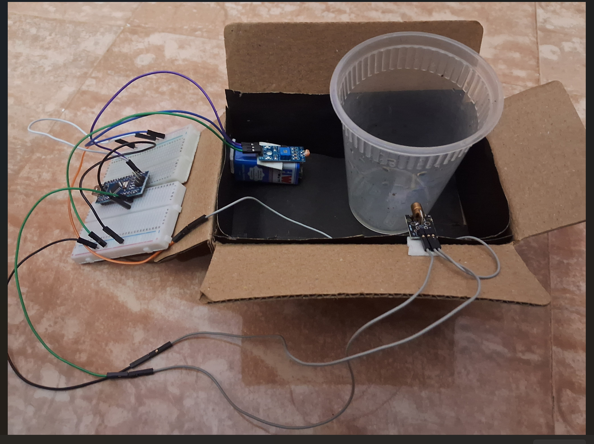
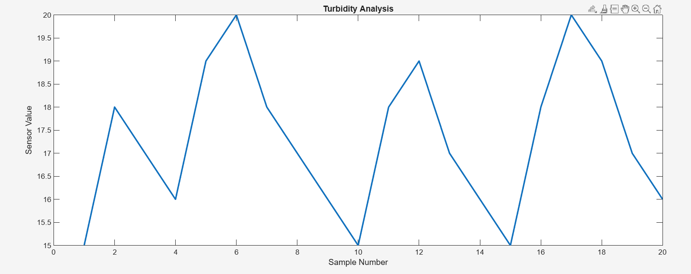
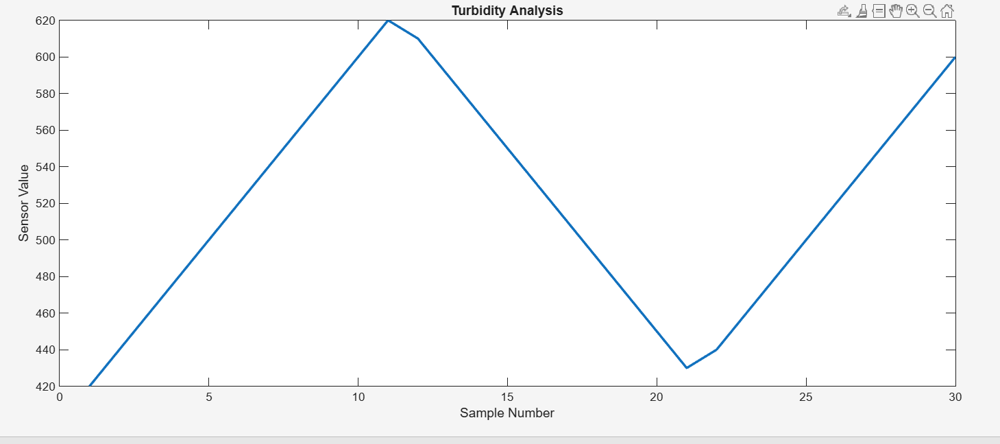

# 💧 Water Turbidity Detection via 90° Light Scattering & MATLAB


> Real-time Water Turbidity Detection using 90° Light Scattering  
> Arduino Nano + MATLAB | Embedded Systems & Signal Processing

> Madras Institute of Technology, Anna University · April 2026

---

## 📌 Overview

This project is a **low-cost water turbidity detection system** built using a laser, LDR, and Arduino Nano.

This project is based on **90° light scattering (nephelometry)**. When a laser beam passes through water:

- Clean water → minimal scattering  
- Turbid water → increased scattering  

The scattered light is detected using an LDR sensor, and the Arduino converts it into analog values. These values are then analyzed in MATLAB.

This setup was built using simple components to understand how turbidity measurement works practically.

---

## 🧰 Hardware Used

- Arduino Nano (ATmega328P)  
- 650nm Red Laser Module  
- LDR Sensor Module  
- Dark Chamber (cardboard box)  
- USB Power Supply  

---

## 🔌 Working 

**Signal Flow:**

Laser → Water Sample → 90° Scattered Light → LDR Sensor → Arduino (ADC) → MATLAB (Analysis & Visualization)


## 💻 Arduino Code

```cpp
const int ldrPin = A0;

void setup() {
  Serial.begin(9600);
}

void loop() {
  int ldrValue = analogRead(ldrPin);   // Read sensor

  Serial.println(ldrValue);            // Send to MATLAB

  delay(200);                          // Stable sampling
}
```


## 📊 MATLAB Code

```matlab
clc; clear;

data = load('turbb.txt');

figure;
plot(data, 'LineWidth', 2);
xlabel('Sample Number');
ylabel('ADC Value');
title('Turbidity Analysis');
grid on;

for i = 1:length(data)
    val = data(i);

    if val < 30
        status = "Clear Water";
    elseif val < 60
        status = "Medium Turbidity";
    else
        status = "High Turbidity";
    end

    disp("Value: " + val + " --> " + status);
end
```


## 📈 Results


| Condition       |   ADC Value |  Output |
| --------------- | ---------   | ------ |
| Clear Water     |   15 – 20   |  Clear  |
| Slightly Turbid |   30 – 55   |  Medium |
| Highly Turbid   |    100+     |  High   |


## 📷 Project Demonstration

### 🧪 Experimental Setup



The experimental setup includes a laser source, water container, and LDR sensor placed at 90° to detect scattered light. A dark chamber is used to avoid external light interference.

---

### 📊 MATLAB Output – Pure Water



This output shows low ADC values, indicating very low light scattering in clean water.

---

### 🌊 MATLAB Output – Turbid Water



This output shows higher ADC values due to increased scattering caused by suspended particles in water.


## 🗂️ Project Structure

water-turbidity-nephelometer/
│
├── arduino/
├── matlab/
├── report/
├── images/
└── README.md


## 🔬 Concept

This project uses nephelometry, where light scattered at 90° is used to estimate particle concentration.


## 🚀 Applications

1. Drinking water quality checking  
2. Small-scale testing  
3. Educational use  


   


## ✅ Conclusion

This project successfully demonstrates a low-cost implementation of turbidity measurement using nephelometry. The results clearly show the relationship between scattered light intensity and water turbidity, validating the working principle.


## 👤 Author
Manikandan Prabhu B  
B.E. ECE, MIT Campus

